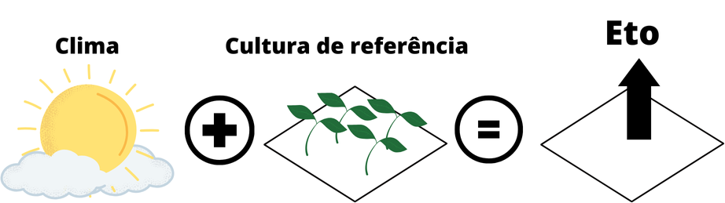

# Estudo sobre previsão de evapotranspiração de referência



## 💻 Sobre o projeto
:smiley: Este é o arquivo principal (Eto_main.py) para executar o projeto Eto. O projeto é responsável por calcular a evapotranspiração de referência (Eto) com base em modelos e horizontes de previsão.


## Pré-requisitos

Certifique-se de ter os seguintes pré-requisitos instalados em sua máquina:
```
    Python 3 (versão recomendada: 3.6 ou superior)
    pip (gerenciador de pacotes Python)
```
Configuração do ambiente

Clone o repositório do projeto ou faça o download do código-fonte.

Abra um terminal ou prompt de comando e navegue até o diretório raiz do projeto.

Opcionalmente, crie uma virtualenv para isolar o ambiente de desenvolvimento. Para fazer isso, execute o seguinte comando:

```
python3 -m venv venv
```
Isso criará um ambiente virtual chamado "venv".

Ative a virtualenv. Dependendo do seu sistema operacional, o comando pode variar:

No Windows:
```
venv\Scripts\activate
```
No macOS e Linux:

```
source venv/bin/activate
```

Instale as dependências do projeto executando o seguinte comando:

```
pip install -r requirements.txt
```
Isso instalará todas as bibliotecas e pacotes necessários para executar o Eto_main.py.

## Executando o aplicativo

Após concluir a configuração do ambiente, você está pronto para executar o aplicativo. Certifique-se de que sua virtualenv esteja ativada (se você criou uma).

No arquivo Eto_main.py, o código importa a biblioteca pandas e algumas funções e modelos de outros arquivos. Em seguida, define as variáveis necessárias, como horizons, model_names, path, station_name, url, e carrega os dados em um dataframe.

Após essa configuração inicial, o código executa uma série de iterações em um loop for. Dentro do loop, diferentes modelos são executados para diferentes horizontes de tempo, e os resultados são salvos em um arquivo CSV.

Para executar o aplicativo, certifique-se de atualizar as variáveis de acordo com sua configuração. Em seguida, execute o seguinte comando:
